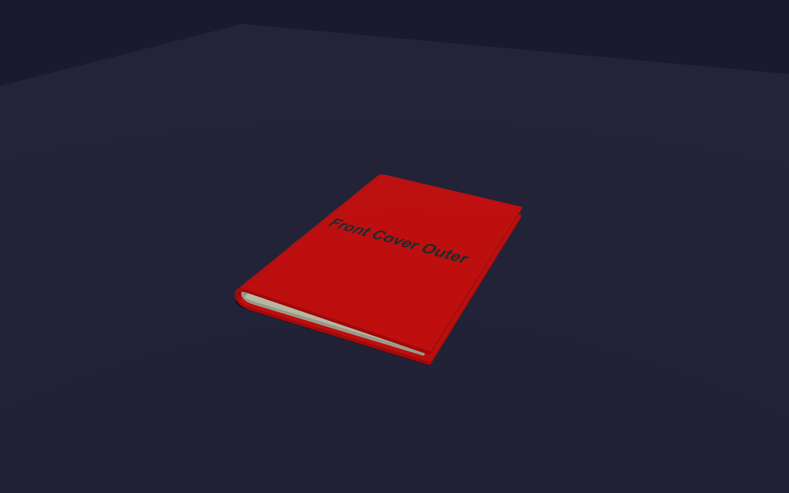
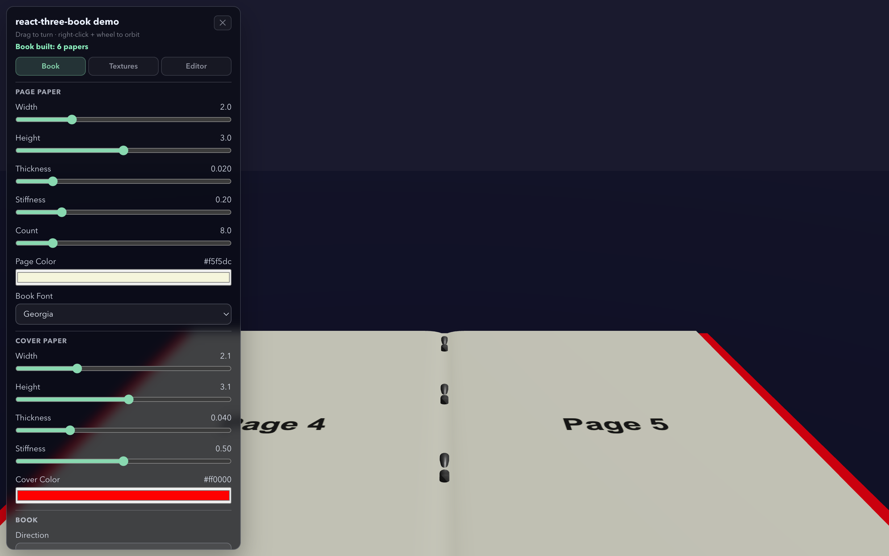
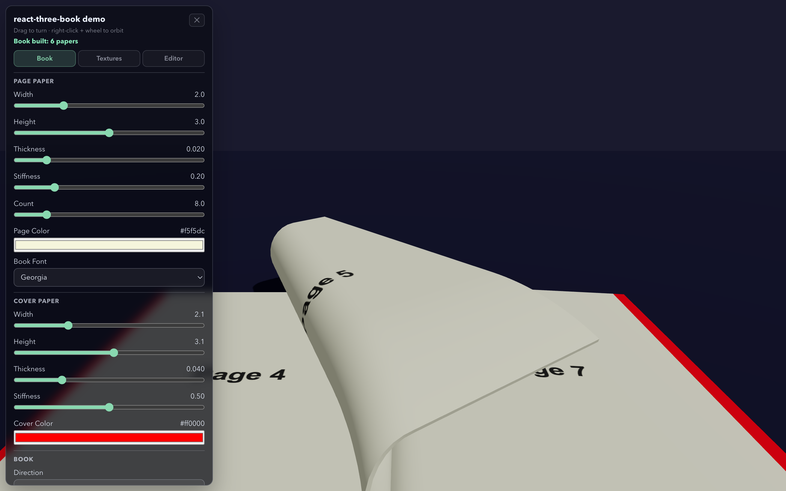
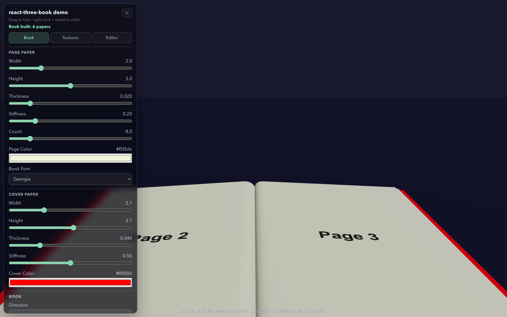

# @objectifthunes/react-three-book

A procedural, interactive 3D book for [React Three Fiber](https://docs.pmnd.rs/react-three-fiber) — drag pages to turn them, apply textures to every surface, and drop `<Book>` into your R3F scene like any other component.

<p align="center">
  
  
</p>
<p align="center">
  
  
</p>

## Features

- **`<Book>` R3F component** — handles init / update / dispose automatically; rebuilds cleanly via React's `key` prop.
- **`<BookInteraction>`** — declarative pointer-drag wiring for interactive page turning; auto-discovers the book from context.
- **Declarative content** — `<Cover>`, `<Page>`, `<Spread>`, and `<Text>` components describe book content as JSX children of `<Book>`.
- **Hooks** — `useBookControls`, `useAutoTurn`, `useBookState`, `useBookContent`, `useTextOverlay`, `usePageTurning`.
- **BookContext** — child components access the book instance without prop-drilling.
- **Per-surface textures** — assign a `THREE.Texture` (or `null`) to each cover side and page side independently.
- **Configurable geometry** — page/cover width, height, thickness, stiffness, color.
- **Texture utilities** — `createPageTexture`, `createPageCanvas`, `drawImageWithFit`, `computeDefaultImageRect`, `loadImage` included.

## Installation

```bash
npm install @objectifthunes/react-three-book three @react-three/fiber react react-dom
```

```bash
pnpm add @objectifthunes/react-three-book three @react-three/fiber react react-dom
```

Peer dependencies: `three >= 0.150.0`, `react >= 18.0.0`, `@react-three/fiber >= 8.0.0`.

## Quick Start

```tsx
import { Canvas } from '@react-three/fiber';
import { OrbitControls } from '@react-three/drei';
import * as THREE from 'three';
import {
  Book,
  BookContent,
  BookDirection,
  BookInteraction,
  StapleBookBinding,
  useBookContent,
} from '@objectifthunes/react-three-book';

function Scene() {
  const orbitRef = useRef(null);

  const content = useBookContent(() => {
    const c = new BookContent();
    c.direction = BookDirection.LeftToRight;
    c.covers.push(frontOuterTex, frontInnerTex, backInnerTex, backOuterTex);
    c.pages.push(page1Tex, page2Tex, page3Tex, page4Tex);
    return c;
  }, []);

  return (
    <>
      <OrbitControls ref={orbitRef} />
      <Book
        content={content}
        binding={new StapleBookBinding()}
        castShadows
        alignToGround
        pagePaperSetup={{ width: 2, height: 3, thickness: 0.02, stiffness: 0.2, color: new THREE.Color(1, 1, 1), material: null }}
        coverPaperSetup={{ width: 2.1, height: 3.1, thickness: 0.04, stiffness: 0.5, color: new THREE.Color(1, 1, 1), material: null }}
      >
        <BookInteraction orbitControlsRef={orbitRef} />
      </Book>
    </>
  );
}

export default function App() {
  return (
    <Canvas shadows camera={{ position: [0, 2, 5], fov: 45 }}>
      <Scene />
    </Canvas>
  );
}
```

## Declarative Mode

Instead of building `BookContent` imperatively, you can declare pages and covers as JSX children of `<Book>`. Each child is a data-only component (renders nothing) whose props are collected during reconciliation.

```tsx
import { Canvas } from '@react-three/fiber';
import { OrbitControls } from '@react-three/drei';
import {
  Book,
  BookDirection,
  BookInteraction,
  Cover,
  Page,
  Spread,
  Text,
  StapleBookBinding,
} from '@objectifthunes/react-three-book';

function Scene() {
  const orbitRef = useRef(null);
  const binding = useMemo(() => new StapleBookBinding(), []);

  return (
    <>
      <OrbitControls ref={orbitRef} />
      <Book binding={binding} direction={BookDirection.LeftToRight}>
        <Cover image={frontImg} fitMode="cover">
          <Text x={50} y={100} fontSize={32}>Title</Text>
        </Cover>
        <Page image={p1} color="#fff">
          <Text x={50} y={200} fontSize={18}>Page text</Text>
        </Page>
        <Spread image={spreadImg}>
          <Text x={100} y={400} width={924}>Across both pages</Text>
        </Spread>
        <BookInteraction orbitControlsRef={orbitRef} />
      </Book>
    </>
  );
}
```

### Declarative Content Components

#### `<Cover>`

Declares a cover surface. A book has 4 cover surfaces; declare up to 4 `<Cover>` elements in order (front outer, front inner, back inner, back outer).

| Prop | Type | Default | Description |
|------|------|---------|-------------|
| `image` | `HTMLImageElement \| null` | `undefined` | Background image |
| `color` | `string` | `undefined` | Background fill color |
| `fitMode` | `ImageFitMode` | `undefined` | How the image is fitted (`"cover"`, `"contain"`, etc.) |
| `fullBleed` | `boolean` | `undefined` | Whether the image fills edge-to-edge |
| `imageRect` | `ImageRect \| null` | `undefined` | Custom position/size in canvas pixels; overrides `fitMode` |
| `children` | `ReactNode` | `undefined` | `<Text>` elements rendered on the surface |

#### `<Page>`

Declares a page side. Each `<Page>` adds one entry to the page list.

Props are identical to `<Cover>`.

#### `<Spread>`

Declares a double-page spread. Produces **two** page entries (left + right). Text coordinates span the full double-width canvas.

Props are identical to `<Cover>`.

#### `<Text>`

Declares a text block inside a `<Cover>`, `<Page>`, or `<Spread>`. Coordinates are in canvas pixels.

| Prop | Type | Default | Description |
|------|------|---------|-------------|
| `x` | `number` | `undefined` | Horizontal position |
| `y` | `number` | `undefined` | Vertical position |
| `width` | `number` | `undefined` | Text wrap width |
| `fontSize` | `number` | `undefined` | Font size in pixels |
| `fontFamily` | `string` | `undefined` | CSS font family |
| `fontWeight` | `"normal" \| "bold"` | `undefined` | Font weight |
| `fontStyle` | `"normal" \| "italic"` | `undefined` | Font style |
| `color` | `string` | `undefined` | Text color |
| `textAlign` | `"left" \| "center" \| "right"` | `undefined` | Horizontal alignment |
| `lineHeight` | `number` | `undefined` | Line height multiplier |
| `opacity` | `number` | `undefined` | Text opacity (0 -- 1) |
| `shadowColor` | `string` | `undefined` | Drop shadow color |
| `shadowBlur` | `number` | `undefined` | Drop shadow blur radius |
| `children` | `string` | **(required)** | The text content |

## Triggering a Rebuild

Change the `key` prop — React unmounts and remounts `<Book>`, which runs a clean dispose → init cycle:

```tsx
<Book key={buildKey} content={content} binding={binding} ... />
```

## Imperative Access

Forward a ref to get the underlying `ThreeBook` instance:

```tsx
const bookRef = useRef<ThreeBook>(null);
<Book ref={bookRef} ... />

// anywhere in event handlers or effects:
bookRef.current?.setOpenProgress(0.5);
```

## Hooks

### `useBookControls(bookRef?)`

```tsx
const { setOpenProgress, setOpenProgressByIndex, stopTurning } = useBookControls();
```

### `useAutoTurn(bookRef?)`

```tsx
const { turnNext, turnPrev, turnAll, startAutoTurning, cancelPendingAutoTurns } = useAutoTurn();

turnNext();                                         // one page forward
turnPrev();                                         // one page back
turnAll(AutoTurnDirection.Next);                    // turn all remaining pages
startAutoTurning(AutoTurnDirection.Next, settings, 5, 0.3); // queue 5 turns, 0.3s delay each
```

### `useBookState(bookRef?)`

Reactive snapshot updated every frame — triggers re-renders only when something actually changes:

```tsx
const { isTurning, isIdle, isAutoTurning, paperCount } = useBookState();
```

### `useBookContent(factory, deps)`

Creates a `BookContent` and disposes its `THREE.Texture`s automatically when `deps` change or the component unmounts:

```tsx
const content = useBookContent(() => {
  const c = new BookContent();
  c.covers.push(myTexture);
  c.pages.push(pageA, pageB);
  return c;
}, [rebuildKey]);
```

### `useTextOverlay(options?)`

Creates and manages a `TextOverlayContent` instance with per-frame compositing. The overlay's canvas is re-composited every frame (source + text blocks). Material sync is performed automatically when inside a `<Book>` tree.

```tsx
import { useTextOverlay } from '@objectifthunes/react-three-book';

const overlay = useTextOverlay({ width: 512, height: 512, source: baseCanvas });
overlay.addBlock({ x: 10, y: 20, text: 'Hello' });
```

Options: `{ width?: number, height?: number, source?: CanvasImageSource | null }`.

Returns a stable `TextOverlayContent` reference.

### `usePageTurning(bookRef, options?)`

Low-level hook used internally by `<BookInteraction>`. Use the component unless you need raw access.

## Context

Any component rendered inside `<Book>` can access the instance:

```tsx
function PageButtons() {
  const { turnNext, turnPrev } = useAutoTurn(); // no ref needed
  return (
    <>
      <button onClick={turnPrev}>◀</button>
      <button onClick={turnNext}>▶</button>
    </>
  );
}

<Book ...>
  <BookInteraction />
  <PageButtons />  {/* outside the canvas, as an overlay */}
</Book>
```

## Texture Utilities

```tsx
import {
  createPageTexture,
  createPageCanvas,
  drawImageWithFit,
  computeDefaultImageRect,
  loadImage,
  PX_PER_UNIT,
} from '@objectifthunes/react-three-book';
import type { ImageRect } from '@objectifthunes/react-three-book';

// Canvas-based texture with optional image overlay
const tex = createPageTexture('#ff0000', 'Cover', myImage, 'cover', true);

// Create a raw canvas for custom drawing (dimensions based on page size * PX_PER_UNIT)
const canvas = createPageCanvas(width, height);

// Compute image placement rectangle for a given fit mode
const rect: ImageRect = computeDefaultImageRect(image, canvasWidth, canvasHeight, 'cover');

// Load a File into an HTMLImageElement
const result = await loadImage(file); // { image, objectUrl } | null

// PX_PER_UNIT — canvas pixels per world unit (used for page canvas sizing)
```

## Content Model

**Covers** — 4 entries, one per surface:

| Index | Surface |
|-------|---------|
| 0 | Front outer |
| 1 | Front inner |
| 2 | Back inner |
| 3 | Back outer |

**Pages** — ordered list of page-side textures. Each entry can be a `THREE.Texture`, an `IPageContent` implementation, or `null` (renders the base paper color).

## Auto Turn

```tsx
import { AutoTurnDirection, AutoTurnSettings } from '@objectifthunes/react-three-book';

const { startAutoTurning } = useAutoTurn();

const settings = new AutoTurnSettings();
settings.mode = AutoTurnMode.Edge;
startAutoTurning(AutoTurnDirection.Next, settings, 3);
```

## API Surface

| Category | Exports |
|----------|---------|
| Components | `Book`, `BookInteraction` |
| Declarative content | `Cover`, `Page`, `Spread`, `Text` |
| Context | `BookContext`, `useBook`, `useRequiredBook` |
| Hooks | `useBookRef`, `useBookContent`, `useTextOverlay`, `useBookControls`, `useAutoTurn`, `useBookState`, `usePageTurning` |
| Texture utils | `createPageTexture`, `createPageCanvas`, `drawImageWithFit`, `computeDefaultImageRect`, `loadImage`, `PX_PER_UNIT` |
| Types | `ImageRect`, `ImageFitMode`, `LoadedImage` |
| Core | `ThreeBook`, `BookContent`, `BookDirection`, `Paper`, `PaperSetup` |
| Binding | `BookBinding`, `StapleBookBinding`, `StapleBookBound`, `StapleSetup` |
| Content | `IPageContent`, `PageContent`, `SpritePageContent2`, `TextOverlayContent`, `SpreadContent`, `TextBlock` |
| Auto turn | `AutoTurnDirection`, `AutoTurnMode`, `AutoTurnSettings`, `AutoTurnSetting` |

## Development

```bash
pnpm install
pnpm build   # build the library
pnpm dev     # build library + start demo app
```
